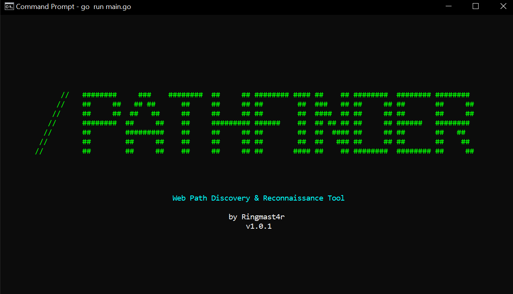
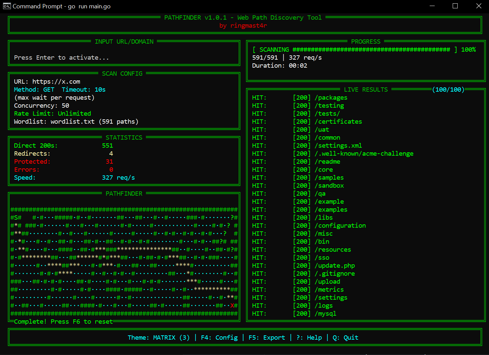

# PathFinder v1.0.1

**Military-grade web path discovery with real-time TUI dashboard and animated pathfinding visualization.**


Built by **ringmast4r** for professional penetration testing and security assessments.

---

## Screenshots

### Adaptive Splash Screen


### Full TUI Dashboard


---

## What Makes PathFinder Different

### Visual Intelligence
- **Adaptive Splash Screen** - Fully responsive logo that scales to any terminal size
  - 7 logo variants from full ASCII art to minimal "//" icon
  - Dynamic selection based on terminal width
  - Diagonal slash "/" effect preserved at all sizes
  - Zero wrapping guaranteed - works on tiny to massive terminals
- **Real-Time BFS Pathfinding Animation** - Watch breadth-first search algorithm solve a randomly generated maze
  - Every maze is unique with random walls and solution paths
  - Animation speed matches your actual scan speed (fast scan = fast animation)
  - Blue dots show exploration, yellow stars trace the optimal path
  - Press F6 to generate new maze
- **Full TUI Dashboard** - Live statistics, progress tracking, and 10 color themes (Matrix, Blood, Skittles, Cyber, Rainbow, etc.)
- **3D Globe Visualization** - Rotating Earth with theme-aware coloring (F3)
- **Animated Progress** - Visual feedback synchronized with scan completion

### Scanner Excellence
- **Complete Redirect Chain Tracking** - See every redirect with timestamps, not just final destination
- **Direct vs Redirected Classification** - Know what's truly accessible vs redirect tricks
- **Wildcard Detection** - Automatic filtering of catch-all responses
- **Content Fingerprinting** - MD5 hashing to identify duplicate pages
- **Thread-Safe Statistics** - Atomic counters for accurate real-time metrics

### Professional Output
- **Executive Summary Export** (F5) - Military-grade pentest reports with risk assessment
- **Interactive Config Menu** (F4) - Adjust settings mid-scan without restarting
- **Scrollable Results** - Navigate thousands of findings with arrow keys
- **Local Network Intel** - Interface, IP, MAC, Subnet, Gateway display
- **OpSec Privacy Toggle** (F7) - Hide network info for screenshots/recordings
- **Multiple Export Formats** - JSON, CSV, Text

### Performance
- **2000-5000+ req/s** - Optimized Go concurrency with connection pooling
- **Dynamic Throttling** - Rate limiting and delay controls
- **Smart Filtering** - By status codes, content size, regex patterns
- **Low Resource Usage** - Efficient memory management

---

## Quick Start

### Windows (Easiest)
```cmd
SCAN.bat example.com
```

### Direct Usage
```bash
pathfinder.exe -target https://example.com
```

---

## Keyboard Controls

| Key | Action |
|-----|--------|
| `Enter` | Activate input / Submit new target |
| `F1` | Toggle help screen (industry standard) |
| `F2` | Hide local network info (OpSec mode) |
| `F3` | Regenerate Skittles colors |
| `F4` | Open config menu (adjust settings live) |
| `F5` | Export pentest report |
| `F6` | Reset pathfinder maze |
| `Delete` | Cancel active scan immediately |
| `` ` `` | Cycle color themes |
| `?` | Toggle help screen (alternative) |
| `↑` / `↓` | Scroll results |
| `1-9`, `0` | Jump to specific theme |
| `Q` | Quit with summary |

---

## Command-Line Options

### Core
```bash
-target <url>         Target URL (required)
-wordlist <file>      Path to wordlist (default: wordlist.txt)
-concurrency <n>      Simultaneous requests (default: 50)
-timeout <n>          Request timeout in seconds (default: 10)
```

### Filtering
```bash
-mc <codes>          Match status codes (200,301,302)
-fc <codes>          Filter status codes (404)
-fs <sizes>          Filter content sizes
```

### Performance
```bash
-rate <n>            Max requests/second (0=unlimited)
-delay <n>           Delay between requests (ms)
```

### HTTP
```bash
-X <method>          HTTP method (GET, POST, HEAD, etc.)
-H <header>          Custom header (Name:Value)
-cookie <data>       Cookie string
-x <exts>            File extensions (php,html,js)
```

### Output
```bash
-o <file>            Output file
-of <format>         Format: text, json, csv
-theme <name>        Starting theme
-verbose             Show errors and debug info
```

---

## Wordlist Recommendations

### Current Wordlist
- **Included**: 719 curated entries covering common web paths, CMS-specific routes, API endpoints
- **Focus**: Quality over quantity, organized by category
- **Suitable for**: Quick scans, initial reconnaissance, targeted testing

### Industry-Standard Alternatives

For comprehensive scanning, PathFinder is compatible with **SecLists** (industry standard):

**Download SecLists:**
```bash
# Option 1: Clone full repository
git clone https://github.com/danielmiessler/SecLists.git

# Option 2: Direct download (Linux/Mac)
wget https://github.com/danielmiessler/SecLists/archive/master.zip
```

**Recommended WordLists:**
1. **directory-list-2.3-medium.txt** (~220k entries) - Most popular, proven track record
2. **raft-large-directories.txt** (~62k entries) - Directory names
3. **raft-large-files.txt** (~37k entries) - Common filenames
4. **common.txt** (~4,600 entries) - Balance of speed and coverage

**Usage:**
```bash
pathfinder.exe -target https://example.com -wordlist SecLists/Discovery/Web-Content/directory-list-2.3-medium.txt
```

### What We Don't Have
- **No duplicate entries** - Our included wordlist is deduplicated
- **No massive file size** - Focused on efficiency
- **No bloat** - Every entry has a purpose

PathFinder prioritizes **precision** over brute force. For maximum coverage, combine our optimized scanner with SecLists wordlists.

---

## Real-World Examples

### Bug Bounty Recon
```bash
pathfinder.exe -target https://target.com \
  -wordlist SecLists/directory-list-2.3-medium.txt \
  -concurrency 100 -rate 200 \
  -o results.json -of json
```

### API Discovery
```bash
pathfinder.exe -target https://api.example.com \
  -H "Authorization:Bearer TOKEN" \
  -mc 200,201,401 -fc 404
```

### Admin Panel Hunt
```bash
pathfinder.exe -target https://target.com \
  -mc 200,301,302,401,403 -fc 404
```

### Authenticated Scan
```bash
pathfinder.exe -target https://target.com \
  -cookie "session=abc123; auth=xyz"
```

---

## Performance Comparison

| Tool | Speed (req/s) | Redirect Tracking | TUI | Themes | Reports |
|------|---------------|-------------------|-----|--------|---------|
| **PathFinder** | **2000-5000+** | ✅ Full chain | ✅ Full | ✅ 10 | ✅ Military |
| gobuster | 1000-3000 | ❌ No | ❌ No | ❌ No | ❌ No |
| ffuf | 1500-4000 | ❌ No | ❌ No | ❌ No | ❌ No |
| feroxbuster | 2000-3000 | ⚠️ Basic | ⚠️ Basic | ❌ No | ❌ No |

---

## Building from Source

### Prerequisites
- Go 1.16+
- Windows/Linux/macOS

### Build
```bash
# Windows
go build -ldflags="-s -w" -o pathfinder.exe main.go

# Linux
GOOS=linux GOARCH=amd64 go build -ldflags="-s -w" -o pathfinder main.go

# macOS
GOOS=darwin GOARCH=amd64 go build -ldflags="-s -w" -o pathfinder main.go
```

Or use the included build script:
```cmd
build.bat
```

---

## Legal & Ethical Use

⚠️ **WARNING:** Unauthorized scanning is illegal. Only test systems you own or have written permission to assess.

**Legal Risks:**
- Violates CFAA (US) and equivalent laws worldwide
- May breach Terms of Service
- Could be considered hostile reconnaissance

**Best Practices:**
1. ✅ Get written authorization
2. ✅ Start with low concurrency (10-20)
3. ✅ Use rate limiting on production systems
4. ✅ Stop immediately if requested
5. ✅ Have emergency contacts ready

---

## Troubleshooting

### "Error loading wordlist"
Ensure `wordlist.txt` is in the same directory, or use `-wordlist` with full path.

### Terminal display issues
Use Windows Terminal (recommended) or Command Prompt. Ensure 256-color support.

### Scan too fast/slow
Use F4 to adjust concurrency and rate limit in real-time, or:
```bash
# Slower, gentler
pathfinder.exe -target https://example.com -concurrency 10 -rate 50

# Faster, aggressive
pathfinder.exe -target https://example.com -concurrency 200 -timeout 5
```

### No results found
- Try SecLists wordlist
- Check target is reachable: `curl -I https://target.com`
- Use `-verbose` flag
- Verify not being rate limited

---

## Technical Architecture

**Built With:**
- **Language:** Go 1.16+
- **TUI:** tcell/v2 (terminal cell management)
- **HTTP:** Native net/http with custom transport
- **Concurrency:** Goroutines with semaphore pattern

**Core Components:**
- Scanner engine with redirect tracking
- Full-screen TUI dashboard
- 3D globe renderer with Earth bitmap
- BFS pathfinding maze animation
- Thread-safe statistics tracker
- Professional report generator

**Optimizations:**
- Connection pooling (MaxIdleConnsPerHost)
- Goroutine semaphores
- Content MD5 hashing
- Wildcard baseline caching
- 50ms TUI refresh rate

---

## Project Files

```
PathFinder/
├── main.go                    # Core application (8000+ lines)
├── wordlist.txt               # 719 curated web paths
├── build.bat                  # Cross-platform build script
├── SCAN.bat                   # Quick scan launcher
├── README.md                  # This file
├── ROADMAP.md                 # Future features
└── TECHNICAL_NOTES.md         # Implementation details
```

---

## Roadmap

**Critical Priority:**
- [ ] Proxy support (Burp Suite/ZAP)
- [ ] Response body regex filtering
- [ ] Resume/save state
- [ ] Advanced authentication

**High Priority:**
- [ ] Recursive link extraction
- [ ] Multi-target mode
- [ ] Technology detection
- [ ] User-Agent randomization

**Completed:**
- [x] Adaptive splash screen
- [x] Real-time TUI dashboard
- [x] 10 color themes
- [x] 3D globe visualization
- [x] BFS pathfinding maze
- [x] Executive reports (F5)
- [x] Interactive config (F4)
- [x] Wildcard detection
- [x] Redirect chain tracking

---

## Credits

**Author:** ringmast4r

**Inspired by:**
- gobuster (OJ Reeves)
- ffuf (Joona Hoikkala)
- feroxbuster (epi052)
- SecKC-MHN-Globe (globe visualization)

**Wordlist Compatibility:**
- SecLists (danielmiessler)
- dirb/dirbuster wordlists
- Custom wordlists welcome

---

## Support

Found a bug? Feature request?
- Check `ROADMAP.md` for planned features
- Check `TECHNICAL_NOTES.md` for details
- Open an issue on GitHub

---

**Built with Go | Designed for professionals | Open source**

**by ringmast4r**
